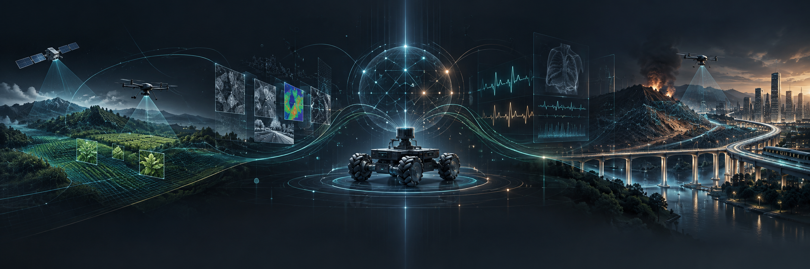

  

# Chitsanupong Kongkraphan

**Chief Executive Officer, [Synventra Co., Ltd.](https://synventra.com)**

Computer Engineering and Digital Technology student  
Faculty of Engineering, Chulalongkorn University

[Personal website](https://champchitsa.com) · [Synventra](https://synventra.com)

 

## Profile

I work on applied artificial intelligence, computer vision, robotics, and software systems. My projects have focused on medical screening, disaster response, agricultural inspection, and campus sustainability.

I was a scholar in the **28th Junior Science Talent Project (JSTP)** administered by the National Science and Technology Development Agency (NSTDA), Thailand.

## Research interests

- Artificial intelligence and computer vision
- Multimodal machine learning
- Autonomous systems and robotics
- Medical and public safety technology

## Selected work

- **Omnidirectional Surface Mobility Apparatus for Remote Controlled Rescue Exploration on Rubble Terrain.** Thai Petty Patent No. 26405, Department of Intellectual Property, Thailand.
- **PuenMor.** Development of an artificial intelligence based risk and trend assessment system for neurological disorders. Funded by the Junior Science Talent Project (JSTP), National Science and Technology Development Agency (NSTDA).
- **SEESEED.** Development of a computer vision platform for corn seed quality grading. Super AI Engineer Season 5.
- **Nematodroid.** Development of an omnidirectional exploration robot with a vision system for disaster victim search. Supported by the National Science and Technology Development Agency (NSTDA) and the National Research Council of Thailand (NRCT).
- **TERMTEM.** Campus water refill gamification for plastic reduction. Funded by the Ton Kla Ramathibodi Project, Faculty of Medicine Ramathibodi Hospital, Mahidol University.

## More information

Additional information about my education, projects, and awards is available at [champchitsa.com](https://champchitsa.com).
